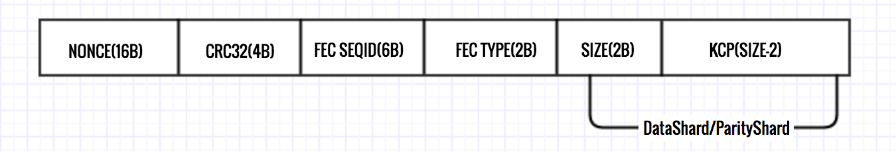

[![GoDoc][1]][2] [![Powered][9]][10] [![MIT licensed][11]][12] [![Build Status][3]][4] [![Go Report Card][5]][6] [![Coverage Statusd][7]][8]

[1]: https://godoc.org/github.com/xtaci/kcp-go?status.svg
[2]: https://godoc.org/github.com/xtaci/kcp-go
[3]: https://travis-ci.org/xtaci/kcp-go.svg?branch=master
[4]: https://travis-ci.org/xtaci/kcp-go
[5]: https://goreportcard.com/badge/github.com/xtaci/kcp-go
[6]: https://goreportcard.com/report/github.com/xtaci/kcp-go
[7]: https://codecov.io/gh/xtaci/kcp-go/branch/master/graph/badge.svg
[8]: https://codecov.io/gh/xtaci/kcp-go
[9]: https://img.shields.io/badge/KCP-Powered-blue.svg
[10]: https://github.com/skywind3000/kcp
[11]: https://img.shields.io/badge/license-MIT-blue.svg
[12]: LICENSE

[](https://en.wikipedia.org/wiki/Claude_Shannon)

> *(Claude Elwood Shannon)*

## Introduction

**kcp-go** is a full-featured ***Reliable-UDP*** library for golang. It provides ***reliable, ordered, and error-checked*** delivery of a stream of octets between applications running on hosts communicating over an IP network. 

**kcp-go** offers ***Production-Grade*** quality, it has been well tested and it's running on millions of devices(from low-end MIPS routers to high-end servers). 

[Lastest Release](https://github.com/xtaci/kcp-go/releases)

## Features

1. Optimized for ***Online Games, Audio/Video Streaming***.
1. Compatible with [skywind3000's](https://github.com/skywind3000) C version with optimizations.
1. ***Cache friendly*** and ***Memory optimized*** design in golang.
1. Compatible with [net.Conn](https://golang.org/pkg/net/#Conn) and [net.Listener](https://golang.org/pkg/net/#Listener).
1. [FEC(Forward Error Correction)](https://en.wikipedia.org/wiki/Forward_error_correction) Support with [Reed-Solomon Codes](https://en.wikipedia.org/wiki/Reed%E2%80%93Solomon_error_correction)
1. Packet level encryption support with [AES](https://en.wikipedia.org/wiki/Advanced_Encryption_Standard), [TEA](https://en.wikipedia.org/wiki/Tiny_Encryption_Algorithm), [3DES](https://en.wikipedia.org/wiki/Triple_DES), [Blowfish](https://en.wikipedia.org/wiki/Blowfish_(cipher)), [Cast5](https://en.wikipedia.org/wiki/CAST-128), [Salsa20]( https://en.wikipedia.org/wiki/Salsa20), etc. in [CFB](https://en.wikipedia.org/wiki/Block_cipher_mode_of_operation#Cipher_Feedback_.28CFB.29) mode.

## Conventions

Control messages like SYN/FIN/RST in TCP ***are not defined*** in KCP, you need some ***keepalive mechanims*** in the application-level. a real world example is to use some ***multiplexing*** protocol over session, such as [smux](https://github.com/xtaci/smux), see [kcptun](https://github.com/xtaci/kcptun) for example.

## Documentation

For complete documentation, see the associated [Godoc](https://godoc.org/github.com/xtaci/kcp-go).

## Specification



## Usage

Client:   [full demo](https://github.com/xtaci/kcptun/blob/master/client/main.go#L231)
```go
kcpconn, err := kcp.DialWithOptions("192.168.0.1:10000", nil, 10, 3)
```
Server:   [full demo](https://github.com/xtaci/kcptun/blob/master/server/main.go#L235)
```go
lis, err := kcp.ListenWithOptions(":10000", nil, 10, 3)
```

## Performance
```
  Model Name:	MacBook Pro
  Model Identifier:	MacBookPro12,1
  Processor Name:	Intel Core i5
  Processor Speed:	2.7 GHz
  Number of Processors:	1
  Total Number of Cores:	2
  L2 Cache (per Core):	256 KB
  L3 Cache:	3 MB
  Memory:	8 GB
```
```
$ go test -run=^$ -v -bench .
beginning tests, encryption:salsa20, fec:10/3
BenchmarkAES128-4          	  200000	     11286 ns/op	 362.90 MB/s
BenchmarkAES192-4          	  100000	     12332 ns/op	 332.14 MB/s
BenchmarkAES256-4          	  100000	     13490 ns/op	 303.62 MB/s
BenchmarkTEA-4             	   50000	     24191 ns/op	 169.31 MB/s
BenchmarkXOR-4             	 5000000	       389 ns/op	10516.55 MB/s
BenchmarkBlowfish-4        	   30000	     46750 ns/op	  87.61 MB/s
BenchmarkNone-4            	20000000	        66.2 ns/op	61870.86 MB/s
BenchmarkCast5-4           	   30000	     60050 ns/op	  68.21 MB/s
Benchmark3DES-4            	    2000	    857810 ns/op	   4.77 MB/s
BenchmarkTwofish-4         	   30000	     56199 ns/op	  72.88 MB/s
BenchmarkXTEA-4            	   20000	     77454 ns/op	  52.88 MB/s
BenchmarkSalsa20-4         	  300000	      4896 ns/op	 836.51 MB/s
BenchmarkEchoSpeed4K-4     	    5000	    266582 ns/op	  15.36 MB/s
BenchmarkEchoSpeed64K-4    	    1000	   1800013 ns/op	  36.41 MB/s
BenchmarkEchoSpeed512K-4   	     100	  13474889 ns/op	  38.91 MB/s
BenchmarkEchoSpeed1M-4     	      50	  26673491 ns/op	  39.31 MB/s
BenchmarkSinkSpeed4K-4     	   20000	     68814 ns/op	  59.52 MB/s
BenchmarkSinkSpeed64K-4    	    2000	    896972 ns/op	  73.06 MB/s
BenchmarkSinkSpeed256K-4   	     200	   7370915 ns/op	  71.13 MB/s
BenchmarkSinkSpeed1M-4     	     100	  13908481 ns/op	  75.39 MB/s
PASS
ok  	github.com/xtaci/kcp-go	37.789s
```

## Tuning

Q: I'm running > 3000 connections on my server. the CPU utilization is high.

A: A standalone `agent` or `gate` server for kcp-go is suggested, not only for CPU utilization, but also important to the **precision** of RTT measurements which indirectly affects retransmission. By increasing update `interval` with `SetNoDelay` like `conn.SetNoDelay(1, 40, 1, 1)` will dramatically reduce system load.

## Who is using this?

1. https://github.com/xtaci/kcptun -- A Secure Tunnel Based On KCP over UDP.
2. https://github.com/getlantern/lantern -- Lantern delivers fast access to the open Internet. 
3. https://github.com/smallnest/rpcx -- A RPC service framework based on net/rpc like alibaba Dubbo and weibo Motan.
4. https://github.com/gonet2/agent -- A gateway for games with stream multiplexing.
5. https://github.com/syncthing/syncthing -- Open Source Continuous File Synchronization.

## Links

1. https://github.com/xtaci/libkcp -- FEC enhanced KCP session library for iOS/Android in C++
2. https://github.com/skywind3000/kcp -- A Fast and Reliable ARQ Protocol
3. https://github.com/klauspost/reedsolomon -- Reed-Solomon Erasure Coding in Go

### Support

You can support this project by the following methods:

1. Vultr promotion code:     
http://www.vultr.com/?ref=6897065

2. Paypal    
https://www.paypal.me/xtaci

Your name or github name will be listed on this page by default.
