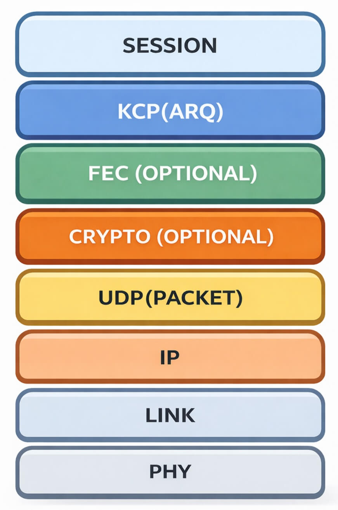

````markdown


[![GoDoc][1]][2] [![Powered][9]][10] [![MIT licensed][11]][12] [![Build Status][3]][4] [![Go Report Card][5]][6] [![Coverage Status][7]][8] [![Sourcegraph][13]][14]

[1]: https://godoc.org/github.com/xtaci/kcp-go?status.svg
[2]: https://pkg.go.dev/github.com/xtaci/kcp-go
[3]: https://img.shields.io/github/created-at/xtaci/kcp-go
[4]: https://img.shields.io/github/created-at/xtaci/kcp-go
[5]: https://goreportcard.com/badge/github.com/xtaci/kcp-go
[6]: https://goreportcard.com/report/github.com/xtaci/kcp-go
[7]: https://codecov.io/gh/xtaci/kcp-go/branch/master/graph/badge.svg
[8]: https://codecov.io/gh/xtaci/kcp-go
[9]: https://img.shields.io/badge/KCP-Powered-blue.svg
[10]: https://github.com/skywind3000/kcp
[11]: https://img.shields.io/badge/license-MIT-blue.svg
[12]: LICENSE
[13]: https://sourcegraph.com/github.com/xtaci/kcp-go/-/badge.svg
[14]: https://sourcegraph.com/github.com/xtaci/kcp-go?badge

## 介绍

**kcp-go** 是一个用于 Go 语言的 **可靠 UDP (Reliable-UDP)** 库。

该库在 UDP 包上提供了 **平滑、可靠、顺序、错误校验与匿名化** 的流式传输接口。经过 [kcptun](https://github.com/xtaci/kcptun) 等开源项目的广泛验证，从低端 MIPS 路由器到高端服务器的数百万设备都在多个场景中部署了基于 kcp-go 的程序，应用包括 **在线游戏、直播、文件同步与网络加速**。

[最新发布](https://github.com/xtaci/kcp-go/releases)

## 特性

1. 为**延迟敏感**场景设计。
2. **缓存友好**与**内存优化**的设计，提供极高性能的核心实现。
3. 在单台普通服务器上可处理 **>5K 并发连接**。
4. 兼容 `net.Conn` 与 `net.Listener`，可作为 `net.TCPConn` 的替代方案。
5. 支持使用 [Reed-Solomon 纠删码](https://en.wikipedia.org/wiki/Reed%E2%80%93Solomon_error_correction) 的 [前向纠错 (FEC)](https://en.wikipedia.org/wiki/Forward_error_correction)。
6. 支持分组级别的多种加密算法（AES/TEA/3DES/Blowfish/Cast5/Salsa20 等），以 CFB 模式工作，实现包的匿名化。
7. 支持 AEAD（认证加密）包加密。
8. 全服务仅创建**固定数量的 goroutine**，考虑到 goroutine 切换成本。
9. 与 skywind3000 的 C 版本兼容并做了若干改进。
10. 平台特定的性能优化：在 Linux 上使用 `sendmmsg` 与 `recvmmsg` 系统调用。

## 文档

完整文档请参考对应的 [Godoc](https://godoc.org/github.com/xtaci/kcp-go)。

### KCP-GO 的分层模型



## 规格说明


```
NONCE:
  16bytes 密码学安全的随机数，每个数据包的 nonce 都会改变。
  
CRC32:
  使用 IEEE 多项式计算的数据 CRC-32 校验
 
FEC TYPE:
  typeData = 0xF1
  typeParity = 0xF2
  
FEC SEQID:
  在范围 [0, (0xffffffff/shardSize) * shardSize - 1] 内单调递增
  
SIZE:
  KCP 帧大小加上 2

KCP Header
+------------------+
| conv      uint32 |
+------------------+
| cmd       uint8  |
+------------------+
| frg       uint8  |
+------------------+
| wnd      uint16  |
+------------------+
| ts       uint32  |
+------------------+
| sn       uint32  |
+------------------+
| una      uint32  |
+------------------+
| data     []byte  |
+------------------+
```

## 性能
（省略基准输出，详见英文版）

## 关键设计要点

### 1. 切片 vs 链表

`kcp.flush()` 每 20 ms 遍历发送队列以检查重传。切片相较于 `container/list` 在缓存局部性上优势显著，从而带来更低的 CPU 使用。

### 2. 定时准确性 vs 系统调用 `clock_gettime`

精确的时钟对 RTT 估计至关重要，但频繁调用 `time.Now()` 有开销。在 kcp-go 中，`time.Now()` 的调用被降到最小以平衡准确性与性能。

### 3. 内存管理

主要从全局 buffer pool（`xmit.Buf`）分配内存，重用固定容量的切片以降低 GC 压力。

### 4. 信息安全

kcp-go 提供多种包级别加密算法并使用 CFB 模式。每个包使用系统熵生成的 nonce，保证相同明文不会产生相同密文。即使上层有加密，仍建议启用传输层加密以保护头部不被篡改。

## 连接终止

KCP 中没有定义像 TCP 的 SYN/FIN/RST 控制消息，应用层需要实现心跳/保活机制。推荐在会话上使用复用协议（如 [smux](https://github.com/xtaci/smux)）来管理连接生命周期。

## 常见问题

**Q: 我在服务器上处理 >5K 连接时 CPU 很高，怎么办？**

**A:** 建议使用独立的 `agent` 或 `gate` 服务来运行 kcp-go，以降低 CPU 占用并提高 RTT 测量的精度。调整 `SetNoDelay` 的更新间隔也能显著降低系统负载。

**Q: 何时启用 FEC？**

**A:** 长距离传输或高丢包环境下建议启用 FEC，以减少基于重传的延迟成本。

**Q: 我应该启用加密吗？**

**A:** 建议启用，以提高传输安全性。

## 谁在使用 kcp-go？

见英文版链接列表（包括 kcptun、lantern、rpcx、syncthing 等）。

## 示例

1. [简单示例](https://github.com/xtaci/kcp-go/tree/master/examples)
2. [kcptun 客户端](https://github.com/xtaci/kcptun/blob/master/client/main.go)
3. [kcptun 服务端](https://github.com/xtaci/kcptun/blob/master/server/main.go)

## 相关链接

1. https://github.com/xtaci/smux/ -- 流复用库
2. https://github.com/xtaci/libkcp -- 面向 iOS/Android 的 FEC 增强 KCP 库（C++）
3. https://github.com/skywind3000/kcp -- KCP 协议实现（C 版）
4. https://github.com/klauspost/reedsolomon -- Go 版 Reed-Solomon 实现

````
